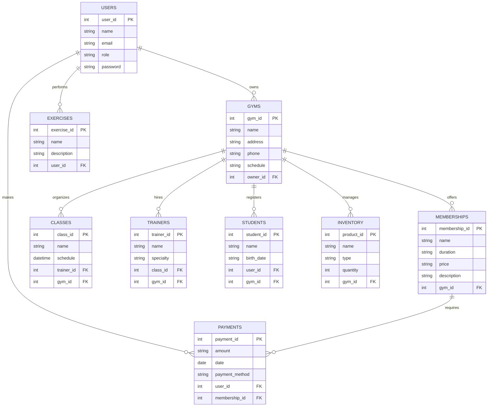

```mermaid
erDiagram
    USERS {
        int user_id PK
        string name
        string email
        string role
        string password
    }

    GYMS {
        int gym_id PK
        string name
        string address
        string phone
        string schedule
        int owner_id FK
    }

    MEMBERSHIPS {
        int membership_id PK
        string name
        string duration
        string price
        string description
        int gym_id FK
    }

    CLASSES {
        int class_id PK
        string name
        datetime schedule
        int trainer_id FK
        int gym_id FK
    }

    TRAINERS {
        int trainer_id PK
        string name
        string specialty
        int class_id FK
        int gym_id FK
    }

    STUDENTS {
        int student_id PK
        string name
        string birth_date
        int user_id FK
        int gym_id FK
    }

    PAYMENTS {
        int payment_id PK
        string amount
        date date
        string payment_method
        int user_id FK
        int membership_id FK
    }

    INVENTORY {
        int product_id PK
        string name
        string type
        int quantity
        int gym_id FK
    }

    EXERCISES {
        int exercise_id PK
        string name
        string description
        int user_id FK
    }

    USERS ||--o{ GYMS : "owns"
    GYMS ||--o{ MEMBERSHIPS : "offers"
    GYMS ||--o{ CLASSES : "organizes"
    GYMS ||--o{ TRAINERS : "hires"
    GYMS ||--o{ STUDENTS : "registers"
    USERS ||--o{ PAYMENTS : "makes"
    MEMBERSHIPS ||--o{ PAYMENTS : "requires"
    GYMS ||--o{ INVENTORY : "manages"
    USERS ||--o{ EXERCISES : "performs"
```
